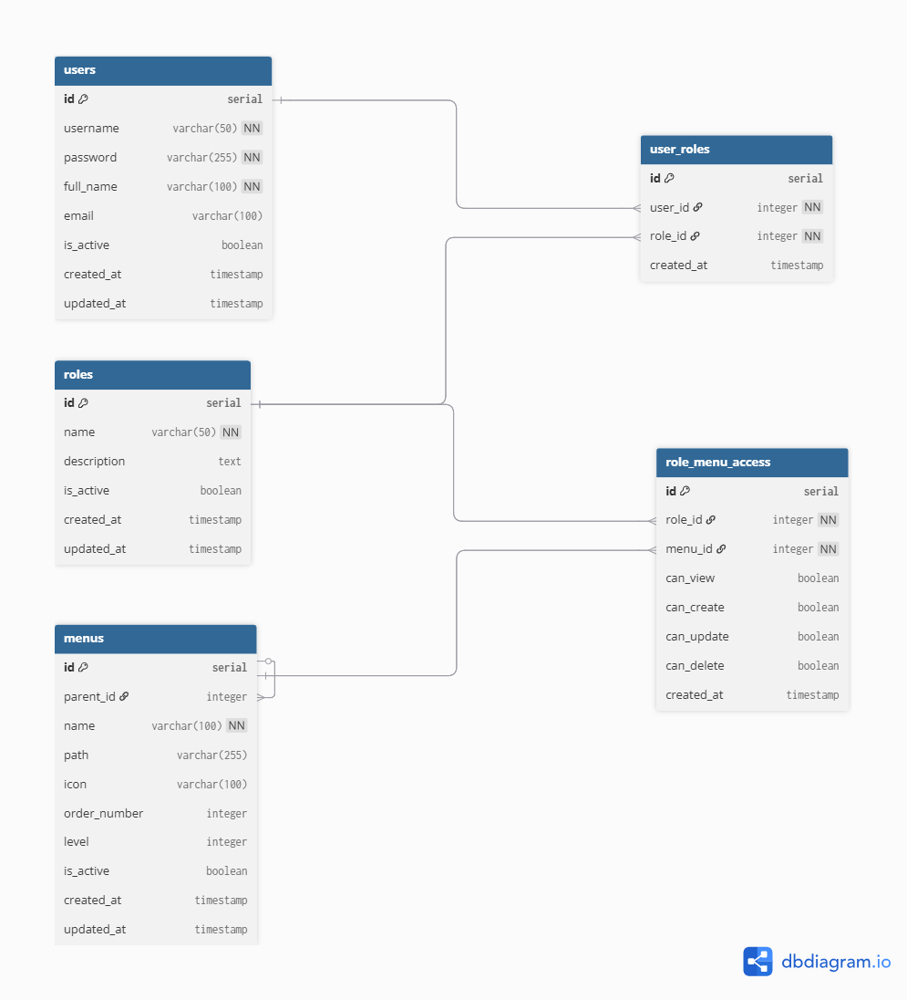
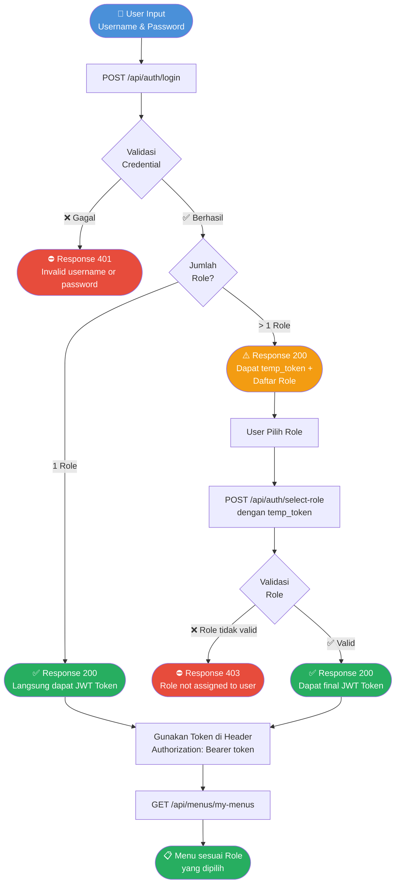

# Backend Test - Login & Management Access

## Tech Stack

- **Runtime**: Node.js
- **Framework**: Express.js
- **Database**: PostgreSQL
- **Auth**: JWT (JSON Web Token)
- **Password Hashing**: bcryptjs

## Setup & Installation

### 1. Clone Repository

```bash
git clone <repo-url>
cd backend-test
```

### 2. Install Dependencies

```bash
npm install
```

### 3. Setup Environment

```bash
cp .env.example .env
# Edit .env sesuai konfigurasi Anda
```

### 4. Setup Database PostgreSQL

```bash
# Buat database
psql -U postgres -c "CREATE DATABASE backend_tes;"

# Jalankan migration
psql -U postgres -d backend_tes -f migrations/init.sql

# Jalankan seeder
node seeders/run-seed.js
```

### 5. Jalankan Server

```bash
npm run dev   # development
npm start     # production
```

---

## Test Accounts

| Username | Password | Roles          |
| -------- | -------- | -------------- |
| admin    | password | admin, manager |
| john     | password | manager, staff |
| jane     | password | staff          |

---

## ERD (Entity Relationship Diagram)



### Struktur Tabel

#### 1. `users` - Data Karyawan

| Column     | Type         | Keterangan                  |
| ---------- | ------------ | --------------------------- |
| id         | serial       | Primary Key, auto increment |
| username   | varchar(50)  | Unique, untuk login         |
| password   | varchar(255) | Bcrypt hashed password      |
| full_name  | varchar(100) | Nama lengkap karyawan       |
| email      | varchar(100) | Email karyawan (opsional)   |
| is_active  | boolean      | Status aktif akun           |
| created_at | timestamp    | Waktu dibuat                |
| updated_at | timestamp    | Waktu terakhir diupdate     |

#### 2. `roles` - Data Role/Jabatan

| Column      | Type        | Keterangan                                |
| ----------- | ----------- | ----------------------------------------- |
| id          | serial      | Primary Key, auto increment               |
| name        | varchar(50) | Unique, nama role (admin, manager, staff) |
| description | text        | Deskripsi role                            |
| is_active   | boolean     | Status aktif role                         |
| created_at  | timestamp   | Waktu dibuat                              |
| updated_at  | timestamp   | Waktu terakhir diupdate                   |

#### 3. `user_roles` - Relasi User & Role (Junction Table)

| Column     | Type      | Keterangan             |
| ---------- | --------- | ---------------------- |
| id         | serial    | Primary Key            |
| user_id    | integer   | Foreign Key → users.id |
| role_id    | integer   | Foreign Key → roles.id |
| created_at | timestamp | Waktu dibuat           |

> Satu user bisa memiliki **banyak role** (jabatan ganda). Unique constraint pada `(user_id, role_id)`.

#### 4. `menus` - Data Menu (Self-Referencing)

| Column       | Type         | Keterangan                               |
| ------------ | ------------ | ---------------------------------------- |
| id           | serial       | Primary Key                              |
| parent_id    | integer      | Foreign Key → menus.id, NULL = root menu |
| name         | varchar(100) | Nama menu                                |
| path         | varchar(255) | URL path menu                            |
| icon         | varchar(100) | Nama icon menu                           |
| order_number | integer      | Urutan tampil menu                       |
| level        | integer      | Level kedalaman (1=root, 2=child, dst)   |
| is_active    | boolean      | Status aktif menu                        |
| created_at   | timestamp    | Waktu dibuat                             |
| updated_at   | timestamp    | Waktu terakhir diupdate                  |

> Mendukung **unlimited level** menu melalui self-referencing pada `parent_id`.

#### 5. `role_menu_access` - Hak Akses Role terhadap Menu (Junction Table)

| Column     | Type      | Keterangan             |
| ---------- | --------- | ---------------------- |
| id         | serial    | Primary Key            |
| role_id    | integer   | Foreign Key → roles.id |
| menu_id    | integer   | Foreign Key → menus.id |
| can_view   | boolean   | Hak akses lihat        |
| can_create | boolean   | Hak akses tambah data  |
| can_update | boolean   | Hak akses ubah data    |
| can_delete | boolean   | Hak akses hapus data   |
| created_at | timestamp | Waktu dibuat           |

> Unique constraint pada `(role_id, menu_id)`.

---

### Relasi Antar Tabel

| Relasi                    | Tipe             | Keterangan                            |
| ------------------------- | ---------------- | ------------------------------------- |
| users → user_roles        | One to Many      | Satu user punya banyak role           |
| roles → user_roles        | One to Many      | Satu role bisa dimiliki banyak user   |
| roles → role_menu_access  | One to Many      | Satu role punya banyak akses menu     |
| menus → role_menu_access  | One to Many      | Satu menu bisa diakses banyak role    |
| menus → menus (parent_id) | Self-referencing | Mendukung menu bertingkat tanpa batas |

---

### Contoh Struktur Menu (Sesuai Soal)

```
Menu 1
├── Menu 1.1
├── Menu 1.2
│   ├── Menu 1.2.1
│   └── Menu 1.2.2
└── Menu 1.3
    └── Menu 1.3.1
Menu 2
├── Menu 2.1
├── Menu 2.2
│   ├── Menu 2.2.1
│   ├── Menu 2.2.2
│   │   ├── Menu 2.2.2.1
│   │   └── Menu 2.2.2.2
│   └── Menu 2.2.3
└── Menu 2.3
Menu 3
├── Menu 3.1
└── Menu 3.2
```

---

### Hak Akses per Role

| Role    | Menu yang Dapat Diakses    | Create | Update | Delete |
| ------- | -------------------------- | ------ | ------ | ------ |
| admin   | Semua menu                 | ✅     | ✅     | ✅     |
| manager | Menu 1, Menu 2 & sub-menu  | ✅     | ✅     | ❌     |
| staff   | Menu 3, Menu 2.1, Menu 2.3 | ❌     | ❌     | ❌     |

---

## API Endpoints

### Authentication

#### POST /api/auth/login

Login dengan username & password.

**Request Body:**

```json
{
  "username": "admin",
  "password": "password"
}
```

**Response (Single Role):**

```json
{
  "success": true,
  "message": "Login successful",
  "data": {
    "user": {
      "id": 1,
      "username": "admin",
      "full_name": "Administrator",
      "email": "admin@example.com"
    },
    "role": {
      "id": 1,
      "name": "admin",
      "description": "Administrator dengan akses penuh"
    },
    "token": "<jwt_token>",
    "requires_role_selection": false
  }
}
```

**Response (Multiple Roles - perlu pilih role):**

```json
{
  "success": true,
  "message": "Login successful. Please select a role.",
  "data": {
    "user": { "id": 1, "username": "admin", "full_name": "Administrator" },
    "roles": [
      { "id": 1, "name": "admin" },
      { "id": 2, "name": "manager" }
    ],
    "requires_role_selection": true,
    "temp_token": "<temp_jwt_token>"
  }
}
```

---

#### POST /api/auth/select-role

Pilih role setelah login (untuk user dengan multiple roles).

**Headers:** `Authorization: Bearer <temp_token>`

**Request Body:**

```json
{ "role_id": 1 }
```

**Response:**

```json
{
  "success": true,
  "message": "Role selected successfully",
  "data": {
    "user": { "id": 1, "username": "admin" },
    "role": { "id": 1, "name": "admin" },
    "token": "<final_jwt_token>"
  }
}
```

---

#### GET /api/auth/me

Get data user yang sedang login.

**Headers:** `Authorization: Bearer <token>`

---

### Menu Management

| Method | Endpoint            | Auth  | Deskripsi                     |
| ------ | ------------------- | ----- | ----------------------------- |
| GET    | /api/menus/my-menus | All   | Menu sesuai role login (tree) |
| GET    | /api/menus          | Admin | Semua menu (tree)             |
| GET    | /api/menus/flat     | Admin | Semua menu (flat list)        |
| GET    | /api/menus/:id      | Admin | Detail menu                   |
| POST   | /api/menus          | Admin | Buat menu baru                |
| PUT    | /api/menus/:id      | Admin | Update menu                   |
| DELETE | /api/menus/:id      | Admin | Hapus menu (soft delete)      |

**POST /api/menus - Request Body:**

```json
{
  "parent_id": 1,
  "name": "Menu Baru",
  "path": "/menu-baru",
  "icon": "icon-name",
  "order_number": 5
}
```

**GET /api/menus/my-menus - Response:**

```json
{
  "success": true,
  "data": [
    {
      "id": 1,
      "parent_id": null,
      "name": "Menu 1",
      "path": "/menu1",
      "level": 1,
      "can_view": true,
      "can_create": true,
      "can_update": true,
      "can_delete": true,
      "children": [
        {
          "id": 4,
          "parent_id": 1,
          "name": "Menu 1.1",
          "level": 2,
          "children": []
        }
      ]
    }
  ]
}
```

---

### Role Management

| Method | Endpoint             | Auth  | Deskripsi                   |
| ------ | -------------------- | ----- | --------------------------- |
| GET    | /api/roles           | Admin | Semua roles                 |
| GET    | /api/roles/:id       | Admin | Detail role                 |
| POST   | /api/roles           | Admin | Buat role baru              |
| PUT    | /api/roles/:id       | Admin | Update role                 |
| DELETE | /api/roles/:id       | Admin | Hapus role                  |
| GET    | /api/roles/:id/menus | Admin | Menu yang di-assign ke role |
| POST   | /api/roles/:id/menus | Admin | Assign menus ke role        |

**POST /api/roles/:id/menus - Request Body:**

```json
{
  "menus": [
    {
      "menu_id": 1,
      "can_view": true,
      "can_create": true,
      "can_update": true,
      "can_delete": false
    },
    {
      "menu_id": 2,
      "can_view": true,
      "can_create": false,
      "can_update": false,
      "can_delete": false
    }
  ]
}
```

---

### User Management

| Method | Endpoint       | Auth  | Deskripsi      |
| ------ | -------------- | ----- | -------------- |
| GET    | /api/users     | Admin | Semua users    |
| GET    | /api/users/:id | Admin | Detail user    |
| POST   | /api/users     | Admin | Buat user baru |
| PUT    | /api/users/:id | Admin | Update user    |
| DELETE | /api/users/:id | Admin | Hapus user     |

**POST /api/users - Request Body:**

```json
{
  "username": "newuser",
  "password": "password123",
  "full_name": "New User",
  "email": "newuser@example.com",
  "role_ids": [2, 3]
}
```

---

## Login Flow


